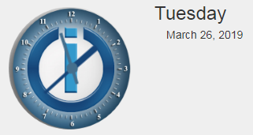
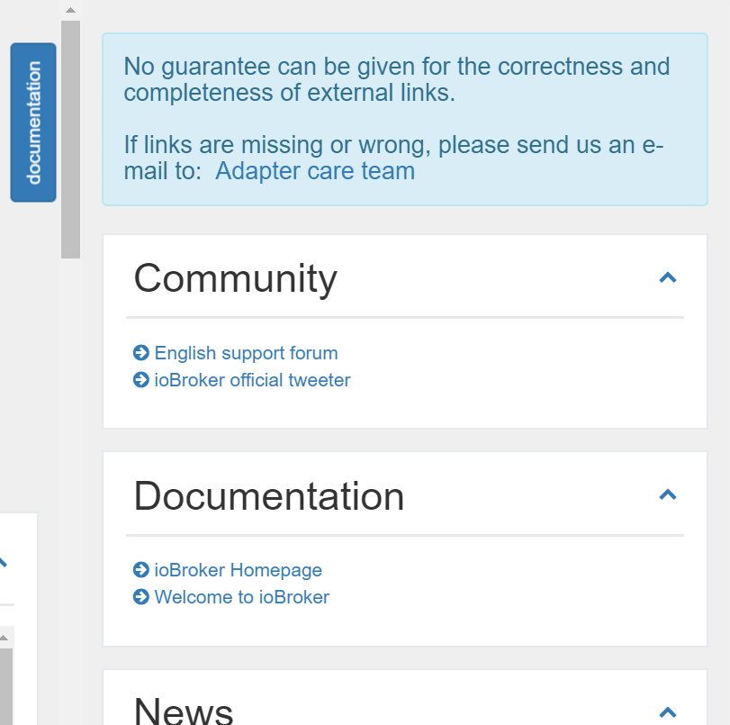
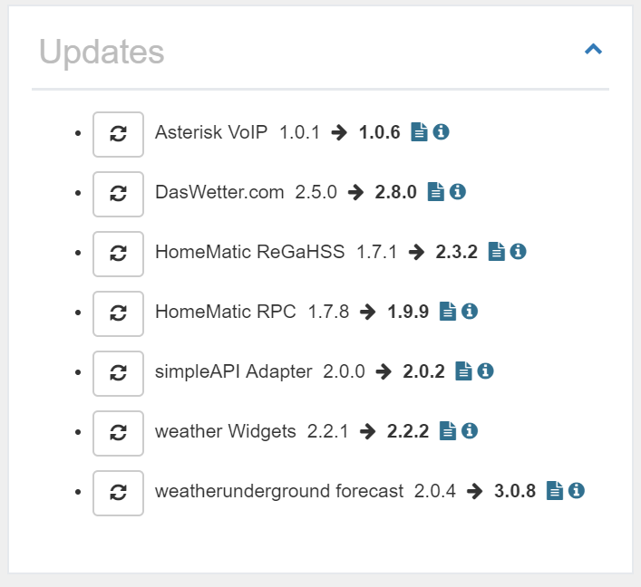
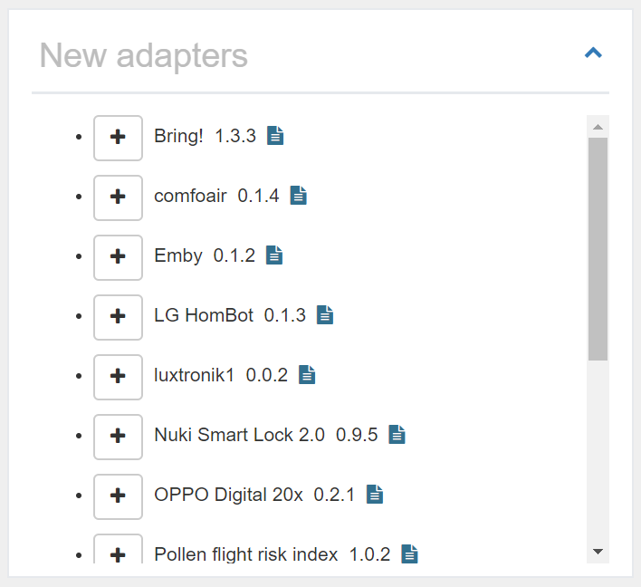
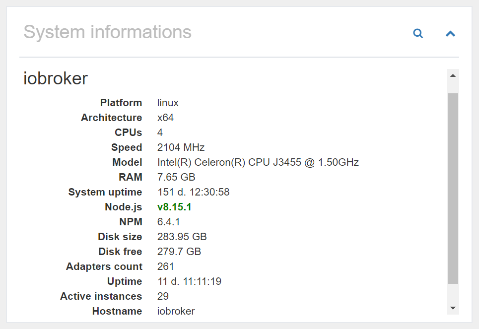
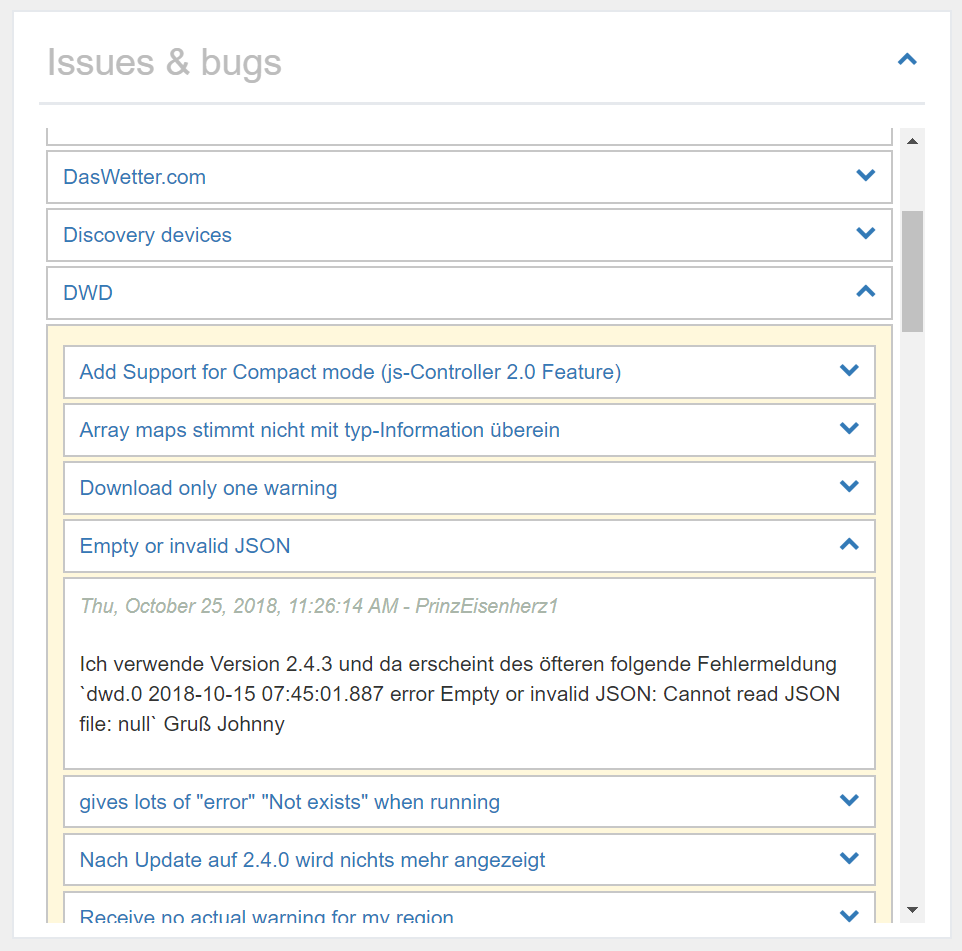
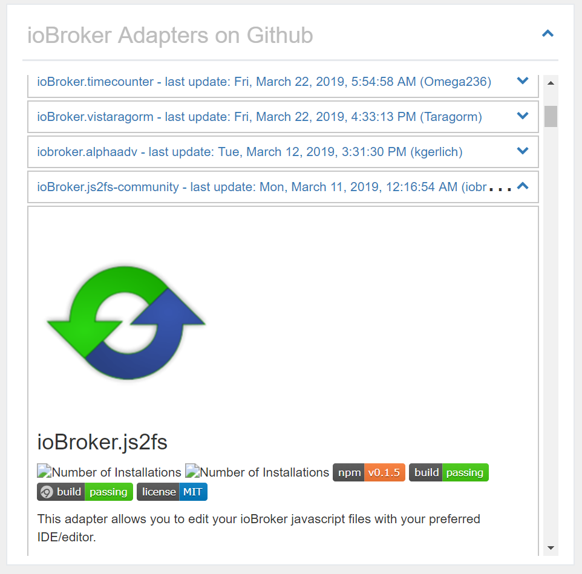
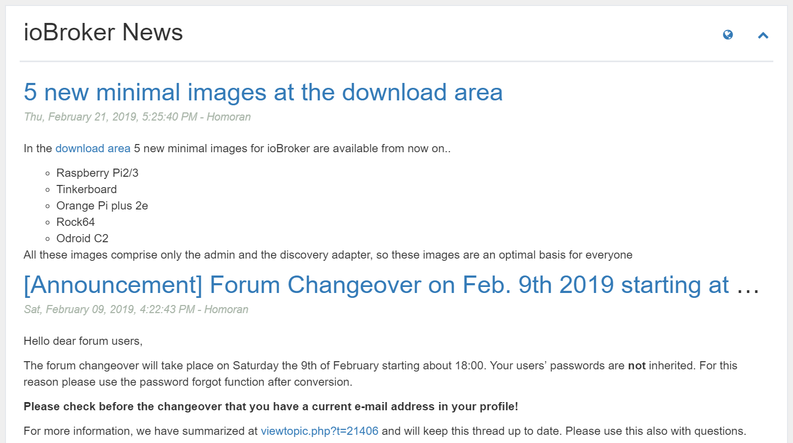
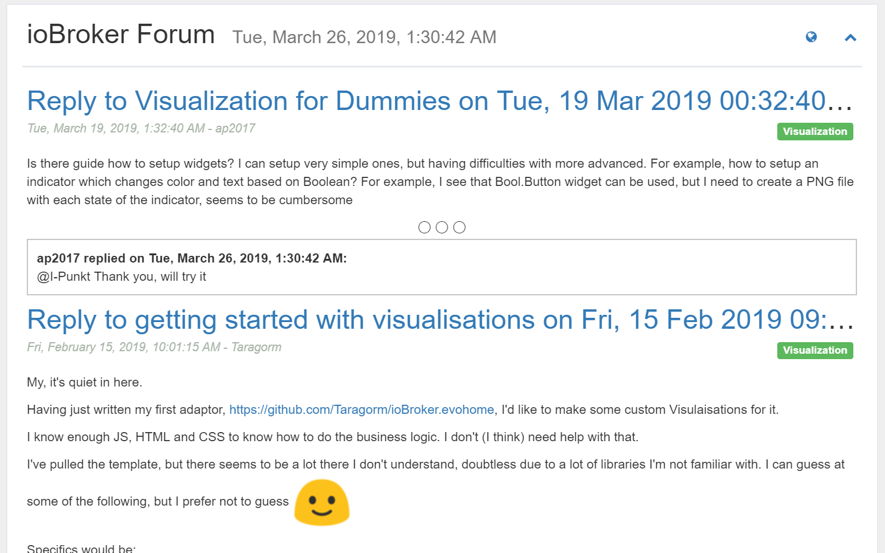

# Admin

The Info Adapter was developed to provide various information about the system, about ioBroker and relevant topics to the user. The user should get an overview of all interesting and important data and the ioBroker team will be given the opportunity to contact the user even faster, if important information is available.

# Installation

In order to see the info window in the Tab tab, you must first check it as Visible in the Admin after installation. To do this, click on the left-hand triangle in the upper left corner of the Admin window and select "Info" in the menu.

# Configuration

* Do not show clock - To hide the clock on the top left.
* Show adapter requests - Displays the panel with the adapter requests.
    * Adapter requests closed at startup - The panel with the adapter requests is closed when the Info window starts.
* View known errors - Displays the panel with known errors and requests for installed adapters.
    * Known errors at startup closed - The panel with the known errors is closed when starting the info window.

* Show News from iobroker.net - Displays the panel with the official ioBroker news.
* Show the latest forum entries - Displays the panel with the last forum entries.
* Feednami API Key - If you call ioBroker using a host name, such as iobroker: 8081 or something like that, you need to sign up for free at Feednami to get an appropriate API key. This is not necessary for access via an IP address.

* Show documentation - Displays the button for the documentation.
    * Select the required languages ​​for the documentation - Selection of the languages ​​to be included in the documentation.

* Search Github for Unknown Adapters (Experts) - Displays the panel searching for unapproved adapters in the github.
    * Sort Adapter by - Sorts the result of the search by name, creation date or last update.
    * reverse order - reverses the order of the results.
    * New adapters closed at startup - The panel with the unknown adapters is closed when starting the info window.

* Do not load current system data - The current system data is not loaded cyclically.
    * Load CPU data every x seconds - The CPU data is cyclically loaded every 1 to 10 seconds. 0 is off.
    * Load memory data every x seconds - The memory data are loaded cyclically every 1 to 10 seconds. 0 is off.
    * Load disk data every x seconds - The hard disk data are loaded cyclically every 1 to 10 seconds. 0 is off.
    * Load battery data every x seconds - Load the battery data cyclically every 1 to 10 seconds. 0 is off.
    * Load network data every x seconds - Load network data cyclically every 1 to 10 seconds. 0 is off.
    * Load process and user data every x seconds - Process and user data are loaded cyclically every 1 to 10 seconds. 0 is off.

# Info Tab

The information tab shows various information about your system and ioBroker. The tab is divided into different parts, which can be customized individually.

## Clock

 The clock has no special function and can be switched off at any time in the configuration.

## Messages

### Messages (VIS-Widget)

## Documentation

## Updates

## New adapters

## System information

### System information (details)

## Adapter requests

## Issues and bugs

## ioBroker adapter on Github

## News

## Forum

