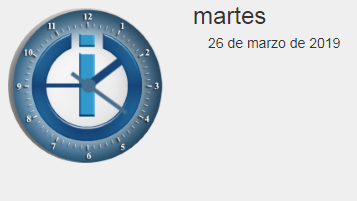

# Admin

El adaptador de información se desarrolló para proporcionar información diversa sobre el sistema, sobre ioBroker y temas relevantes para el usuario. El usuario debe obtener una visión general de todos los datos interesantes e importantes y el equipo de ioBroker tendrá la oportunidad de comunicarse con el usuario aún más rápido, si hay información importante disponible.

# Instalación

Para ver la ventana de información en la pestaña Tab, primero debe verificarla como Visible en el Administrador después de la instalación. Para hacer esto, haga clic en el triángulo de la izquierda en la esquina superior izquierda de la ventana de Administración y seleccione "Información" en el menú.

# Configuración

* No mostrar reloj: para ocultar el reloj en la parte superior izquierda.
* Mostrar solicitudes de adaptador: muestra el panel con solicitudes de adaptador.
    * Solicitudes de adaptador cerradas al inicio: el panel con las solicitudes de adaptador se cierra cuando se inicia la ventana de información.
* Ver errores conocidos: muestra el panel con errores conocidos y solicitudes de adaptadores instalados.
    * Errores conocidos en el inicio cerrado: el panel con los errores conocidos se cierra al iniciar la ventana de información.

* Mostrar noticias de iobroker.net: muestra el panel con las noticias oficiales de ioBroker.
* Mostrar las últimas entradas del foro: muestra el panel con las últimas entradas del foro.
* Clave API de Feednami: si llama a ioBroker con un nombre de host, como iobroker: 8081 o algo así, necesitas registrarte gratis en Feednami para obtener una clave API adecuada. Esto no es necesario para acceder a través de una dirección IP.

* Mostrar documentación: muestra el botón para la documentación.
    * Seleccione los idiomas requeridos para la documentación: selección de los idiomas que se incluirán en la documentación.

* Buscar en Github para adaptadores desconocidos (expertos): muestra el panel en busca de adaptadores no aprobados en el github.
    * Ordenar adaptador por: ordena el resultado de la búsqueda por nombre, fecha de creación o última actualización.
    * Orden inverso: invierte el orden de los resultados.
    * Nuevos adaptadores cerrados al inicio: el panel con los adaptadores desconocidos se cierra al iniciar la ventana de información.

* No cargar datos actuales del sistema: los datos actuales del sistema no se cargan cíclicamente.
    * Cargar datos de la CPU cada x segundos: los datos de la CPU se cargan cíclicamente cada 2 a 10 segundos. 0 está desactivado
    * Cargar datos de la memoria cada x segundos: los datos de la memoria se cargan cíclicamente cada 2 a 10 segundos. 0 está desactivado
    * Cargar datos del disco duro cada x segundos: los datos de la memoria se cargan cíclicamente cada 2 a 10 segundos. 0 está desactivado

# Ficha de información

## reloj

## mensajes

## documentación

## actualizaciones

## Nuevos adaptadores

## Información del sistema

## solicitudes de adaptador

## problemas y errores

## adaptador ioBroker en Github

## noticias

## foro