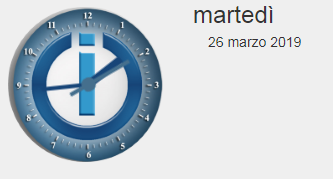

# Admin

L'adattatore di informazioni è stato sviluppato per fornire varie informazioni sul sistema, su ioBroker e argomenti pertinenti all'utente. L'utente dovrebbe avere una panoramica di tutti i dati interessanti e importanti e al team ioBroker verrà data l'opportunità di contattare l'utente ancora più velocemente, se sono disponibili informazioni importanti.

# Installazione

Per visualizzare la finestra informativa nella scheda Scheda, è necessario prima controllarla come Visibile nell'Amministrazione dopo l'installazione. Per fare ciò, fai clic sul triangolo a sinistra nell'angolo in alto a sinistra della finestra di amministrazione e seleziona "Informazioni" nel menu.

# Configurazione

* Non mostrare l'orologio - Per nascondere l'orologio in alto a sinistra.
* Mostra richieste adattatore - Visualizza il pannello con le richieste dell'adattatore.
    * Richieste dell'adattatore chiuse all'avvio - Il pannello con le richieste dell'adattatore viene chiuso all'avvio della finestra Informazioni.
* Visualizza errori conosciuti - Visualizza il pannello con errori noti e richieste di adattatori installati.
    * Errori noti all'avvio chiusi: il pannello con gli errori noti viene chiuso all'avvio della finestra informativa.

* Mostra notizie da iobroker.net - Visualizza il pannello con le notizie ufficiali di ioBroker.
* Mostra le ultime voci del forum - Visualizza il pannello con le ultime voci del forum.
* Chiave API Feednami - Se chiami ioBroker usando un nome host, come iobroker: 8081 o qualcosa del genere, è necessario registrarsi gratuitamente su Feednami per ottenere una chiave API appropriata. Questo non è necessario per l'accesso tramite un indirizzo IP.

* Mostra documentazione - Visualizza il pulsante per la documentazione.
    * Selezionare le lingue richieste per la documentazione - Selezione delle lingue da includere nella documentazione.

* Cerca Github per adattatori sconosciuti (esperti) - Visualizza il pannello alla ricerca di adattatori non approvati nel github.
    * Ordina scheda per - Ordina il risultato della ricerca per nome, data di creazione o ultimo aggiornamento.
    * ordine inverso - inverte l'ordine dei risultati.
    * Nuovi adattatori chiusi all'avvio - Il pannello con gli adattatori sconosciuti viene chiuso all'avvio della finestra informativa.

* Non caricare i dati di sistema attuali - I dati di sistema attuali non vengono caricati ciclicamente.
    * Carica i dati della CPU ogni x secondi - I dati della CPU vengono caricati ciclicamente ogni 2-10 secondi. 0 è spento.
    * Carica i dati della memoria ogni x secondi - I dati della memoria vengono caricati ciclicamente ogni 2-10 secondi. 0 è spento.
    * Carica i dati del disco fisso ogni x secondi - I dati della memoria vengono caricati ciclicamente ogni 2-10 secondi. 0 è spento.

# Scheda Informazioni

## orologio

## messaggi

## documentazione

## aggiornamenti

## Nuovi adattatori

## Informazioni di sistema

## Richieste di adattatori

## problemi ed errori

## adattatore ioBroker su Github

## notizie

## forum