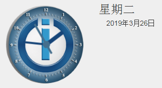

# Admin

信息适配器的开发是为了向用户提供有关系统，ioBroker和相关主题的各种信息。用户应该对所有有趣和重要的数据进行概述，如果有重要信息，ioBroker团队将有机会更快地联系用户。

# 安装

要在“选项卡”选项卡中查看信息窗口，必须先在安装后在Admin中将其检查为“可见”。要执行此操作，请单击“管理”窗口左上角的左侧三角形，然后在菜单中选择“信息”。

# 配置

* 不显示时钟 - 隐藏左上角的时钟。
* 显示适配器请求 - 显示带有适配器请求的面板。
    * 启动时关闭了适配器请求 - 当信息窗口启动时，具有适配器请求的面板将关闭。
* 查看已知错误 - 显示已知错误的面板以及已安装适配器的请求。
    * 启动时已知错误已关闭 - 启动信息窗口时，已关闭具有已知错误的面板。

* 显示来自iobroker.net的新闻 - 显示带有官方ioBroker新闻的面板。
* 显示最新论坛条目 - 显示包含最后论坛条目的面板。
* Feednami API密钥 - 如果您使用主机名称调用ioBroker，例如iobroker：8081或类似的东西，你需要在Feednami免费注册以获得适当的API密钥。这不是通过IP地址访问所必需的。

* 显示文档 - 显示文档的按钮。
    * 选择文档所需的语言 - 选择要包含在文档中的语言。

* 在Github中搜索未知适配器（专家） - 显示在github中搜索未批准的适配器的面板。
    * Sort Adapter by  - 按名称，创建日期或上次更新对搜索结果进行排序。
    * 逆序 - 反转结果的顺序。
    * 启动时关闭新适配器 - 启动信息窗口时，将关闭具有未知适配器的面板。

* 不加载当前系统数据 - 不会循环加载当前系统数据。
    * 每x秒加载CPU数据 -  CPU数据每2到10秒循环加载一次。 0关闭。
    * 每x秒加载内存数据 - 内存数据每2到10秒循环加载一次。 0关闭。
    * 每x秒加载硬盘数据 - 内存数据每2到10秒循环加载一次。 0关闭。

# Info标签

## 时钟

## 消息

## 文档

## 更新

## 新适配器

## 系统信息

## 适配器请求

## 问题和错误

## ioBroker适配器Github上的

## 新闻

## 论坛